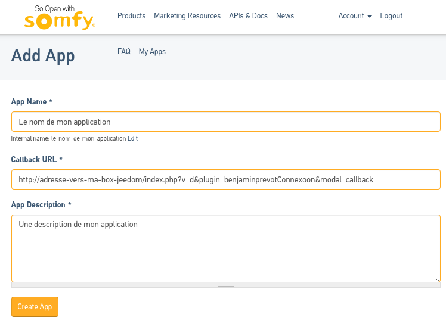

# Documentation en Français

## Description

Ce plugin Jeedom permet de piloter les volets roulants à partir de la box [Connexoon de Somfy](https://www.somfy.fr/produits/1811429/connexoon).

Il utilise l'API mise à disposition [https://developer.somfy.com/](https://developer.somfy.com/).

## Configuration

Pour permettre le bon fonctionnement du plugin, une configuration préalable doit être faite dans le portail du développeur Somfy.

Les informations générés devront ensuite être recopiés dans les paramètres du plugin.

### Portail du développeur

Dans un premier, il faut se connecter à [https://developer.somfy.com/](https://developer.somfy.com/).

Si vous disposez déjà d'un compte sur ce portail, vous pouvez vous rendre directement au paragraphe [Création d'une application](#création-dune-application).

#### Création d'un compte

En haut à droite de l'écran, cliquer sur _Log in_.

__TODO__ : Ajouter les captures pour la création de compte

#### Création d'une application

Une fois connecté au portail du développeur, cliquer dans le menu haut sur _My Apps_.

Vous voyez la liste des applications créées, elle est vide si vous n'en avez pas encore mis en place.

Cliquez sur le bouton _Add a new App_.

Renseignez les informations demandées :
- _App Name_ : Nom que vous souhaitez donner à votre application
- _Callback URL_ : URL vers votre box Jeedom (même si elle n'est pas accessible d'un réseau externe)
- _App Description_ : Une description de votre application

Cliquez sur le bouton _Create App_.

Si tout s'est déroulé correctement, un message indique que l'application est correctement créée et elle apparaît alors dans la liste.

Cliquez ensuite sur la ligne correspondant à votre application.

Les informations de l'application sont affichées, en particulier les clés permettant d'utiliser l'API.

Notez les valeurs des _Consumer Key_ et _Consumer Secret_.

Elles seront utilisées plus tard pour configurer le plugin dans l'interface Jeedom.

### Plugin

Après avoir installé le plugin dans Jeedom, il faut renseigner les informations lui permettant d'utiliser l'API Somfy.

Pour cela, il suffit de renseigner les valeurs de _Consumer Key_ et _Consumer Secret_ notées précédemment.

Ensuite, cliquez sur le bouton _Sauvegarder_.

Une fenêtre s'ouvre vous demandant de reseigner les informations de connexion au portail Somfy puis d'autoriser le plugin à utiliser l'API.
